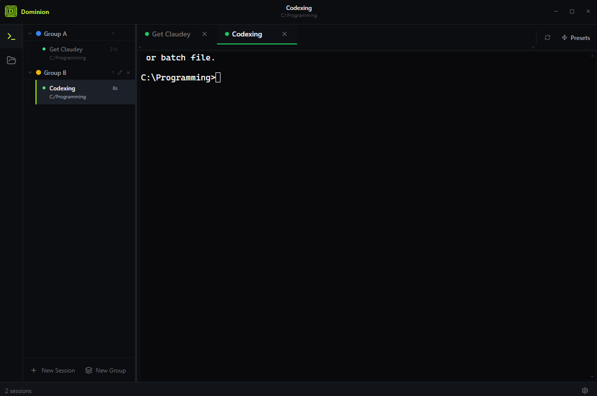

<p align="center">
  
</p>

<h1 align="center">Dominion</h1>

<p align="center">
  A multi-session terminal manager built for AI coding agents.
</p>

<p align="center">
  <a href="https://github.com/CydoEntis/dominion/releases/latest">
    
  </a>
  
</p>

---

<p align="center">
  
</p>

---

## Download

Head to the [Releases](https://github.com/CydoEntis/dominion/releases/latest) page and grab the installer for your platform.

| Platform | File |
|----------|------|
| Windows  | `Dominion-Setup-x.x.x.exe` |
| macOS (Apple Silicon) | `Dominion-x.x.x-arm64.dmg` |
| macOS (Intel) | `Dominion-x.x.x.dmg` |
| Linux (AppImage) | `Dominion-x.x.x.AppImage` |
| Linux (Debian/Ubuntu) | `agent-control-center_x.x.x_amd64.deb` |

> **Note:** Windows and macOS installers are currently unsigned. Windows will show a SmartScreen warning — click **More info → Run anyway**. macOS users right-click the app → **Open**.

---

## Features

- Run multiple AI agent sessions (Claude, Codex, Gemini) side by side
- Full terminal emulation via xterm.js
- Session grouping, presets, and tab management
- Built-in file viewer with syntax highlighting
- Command palette for fast navigation
- Persistent layout and settings

---

## Development

```bash
# Install dependencies
npm install

# Start in dev mode
npm run dev

# Build for your platform
npm run dist
```

Requires [Node.js 20+](https://nodejs.org) and platform build tools for `node-pty` (Visual Studio Build Tools on Windows, Xcode CLI on macOS).
